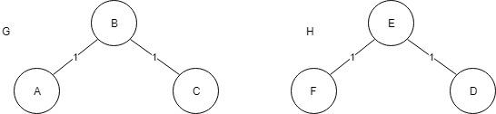

## Teoria dos Grafos
#### Lista 2
###### Profª Luciana Lee
##### _André Thiago Borghi Couto_

---

#### Questão 1
1. Considere um grafo bipartido $G = (X, Y, E)$. Prove que a cardinalidade máxima de um matching em $$G$$ é igual à cardinalidade mínima de uma cobertura de vértices de $$G$$.

	>Começamos definindo um grafo bipartido G(X, Y, E) como um grafo cujos vértices podem ser divididos em dois conjuntos disjuntos X e Y tais que toda aresta conecta um vértice em X a um vértice em Y; ou seja, X e Y são conjuntos independentes. A cardinalidade máxima de um matching desse grafo bipartido pode ser encontrando considerando para cada aresta um par de vértices. Desta forma, a cada aresta que vamos considerando, eliminamos uma outra aresta que usa qualquer um dos vértices desta aresta que acabamos de incluir no nosso matching, no final temos todos os vértices que possuem ligação separado em pares de tal forma que caso há um numero impar de vértices, o ultimo vértice não pertencera ao nosso matching. Neste caso vamos ter um matching máximo para o nosso G(X, Y, E).
	>Desta forma, a cardinalidade do nosso matching máximo vai ser o numero de arestas que incluímos no nosso matching. Agora podemos partir para a questão da cobertura minima. Partimos a partir do nosso matching que temos um conjunto de arestas que ligam vértices de dois conjuntos diferentes. A cobertura nada mais é que um conjunto de vértices em que temos uma ligação com pelo menos uma extremidade de todo o conjunto de arestas do grafo. Como garantimos que temos um matching máximo e cada aresta está ligada a todos os vértices do conjunto do matching, então temos que podemos eliminar uma extremidade de cada aresta. Logo a cardinalidade minima de cobertura vai ser o numero de vértices que está contido no conjunto da cobertura que vemos que é o mesmo valor que o numero de arestas contido no nosso matching pois para cada par de vértices temos uma aresta e eliminamos um vértice de cada par.
	>Sabemos também que mesmo que exista uma aresta amais ligando um vértice que não entrou no conjunto de matching ele também sera representado na cobertura pois uma de suas extremidades está presente no matching.

#### Questão 2
2. Denote por $$\chi(G)$$ o número cromático de um grafo $$G$$. Prove que todo grafo $$G$$ com m arestas satisfaz: $$\chi(G) \leq \frac{1}{2} \sqrt{2m + \frac{1}{4}}$$

	>Queremos provar que: $$\chi(G) \leq \frac{1}{2} \sqrt{2m + \frac{1}{4}}$$
	>Começamos analisando que o nosso $$\chi(G) = k$$ onde $$k$$ define o menor numero de cores com qual conseguimos colorir os vértices do grafo $$G$$ de tal forma que a coloração seja própria. Uma coloração é própria se todos os vértices que são adjacentes possuem cores diferentes. Queremos primeiro encontrar uma descrição para o numero de arestas em um grafo colorido $$G$$. Notamos que todo par de vértices possuem 2 cores e são ligados por uma aresta, ou seja, em cada extremidade da aresta temos um vértice com uma cor. Logo estabelecemos uma relação que para cada par de cores, vamos ter uma aresta que os liga. Notamos que um mesmo vértice com certa cor pode ser ligado a mais de uma aresta. Desta forma, vamos ter $$\left(\frac{k}{2}\right)$$ arestas.
	>Esse $$\left(\frac{k}{2}\right)$$ é uma combinação sem repetição, ou seja, vamos parear as cores sem que haja repetição de pares adjacentes já existentes.
	>Podemos usar a formula para uma combinação do tipo $$\left(\frac{n}{k}\right)$$ para calcular o valor minimo de arestas que existem no grafo. Temos que
	$$\left(\frac{n}{k}\right) = \frac{n!}{k! (n - k)!}$$
	>Aplicando esta formula no nosso problema temos que
	$$\left(\frac{k}{2}\right) = \frac{k!}{2! (n - 2)!} = \frac{k (k - 1) (k - 2) ... (1)}{2! (k - 2) ... (1)}$$
	>Podemos eliminar os termos em comum para finalizar que
	$$\left(\frac{k}{2}\right) = \frac{k (k - 1)}{2}$$
	>Notamos que isso é o meu valor minimo de arestas, ele é o valor de arestas apenas para estabelecer um par entre cada cor, porém sabemos que posso ter muito mais arestas (no caso em que temos mais de um vértice com mesma cor). Logo temos que
	>$$m \geq \frac{k(k - 1)}{2}$$
	$$\Rightarrow 2m \geq k^2 - k$$
	$$\Rightarrow 2m + \frac{1}{4} \geq k^2 - k + \frac{1}{4}$$
	$$\Rightarrow 2m + \frac{1}{4} \geq \left( k - \frac{1}{2}\right)^2$$	
	$$\Rightarrow \sqrt{2m + \frac{1}{4}} \geq k - \frac{1}{2}$$	
	$$\Rightarrow \sqrt{2m + \frac{1}{4}} + \frac{1}{2} \geq k$$
	
	>Voltamos substituindo $$\chi(G) = k$$ e provamos que $$\chi(G) \leq \frac{1}{2} \sqrt{2m + \frac{1}{4}}$$
	
#### Questão 3
3. Sejam $$G$$ e $$H$$ dois grafos e $$f$$ uma bijeção de $$V_G$$ em $$V_H$$ tal que $$d_G (v) = d_H (f (v))$$ para todo $$v$$ em $$V_G$$. É verdade que $$G \equiv H$$? Justifique.
	
	>A afirmação é verdadeira pois estamos fazendo uma analise vértice a vértice. Temos que, se para todo o conjunto de vértices, o grau de cada $$v_G$$ é igual ao grau de $$w_H$$ onde $$w_H = f(v_G)$$ então estamos garantindo que para cada vértices, todos eles possuem as mesmas ligações. Caso o grafo não fosse isomorfo, em algum ponto que aplicamos a função bijetora sob o vértice $$v_H$$ encontraríamos um grau diferente mostrando que existiria um vertice ou aresta a mais, isto é um absurdo, o que nos permitiria concluir que os grafos não são isomorfos. Portanto podemos concluir que existe pelo menos um mapeamento de vértices que torna o grafo $$G$$ isomorfo a H.

#### Questão 4
4. Certo ou errado? Para mostrar que dois grafos $$G$$ e $$H$$ com mesmo número de vértices não são isomorfos basta exibir uma bijeção $$f$$ de $$V_G$$ em $$V_H$$ e um par de vértices $$u$$ e $$v$$ em $$V_G$$ tal que $$(1)(u, v) \in E_G$$ mas $$(f(u), f(v)) \ni E_H$$ ou $$(2) (u, v) \ni E_G$$ mas $$f (u), f (v) \in E_H$$. Justifique sua resposta.
	
	>Afirmativa errada. Mostrar que os grafos não são isomorfos por usar um função bijetora não nos garante que eles não são isomorfos, a única coisa que podemos afirmar com isto é que a nossa função bijetora utiliza um mapeamento errado para o grafo. Por exemplo na figura 2 temos que a nossa função bijetora é dada por
	$$G_A = H_F$$
	$$G_B = H_E$$
	$$G_C = H_D$$
	
	>Caso usamos uma função bijetora errada dada por
	$$G_A = H_E$$
	$$G_B = H_D$$
	$$G_C = H_F$$
	
	>Temos que aresta (B, C) existe em G porém (D, F) não existe logo temos que uma aresta que existe em um grafo não existe em outro, e fora que os graus do vértices são diferentes, logo, está função bijetora está errada, porém notamos que com a função bijetora correta, os grafos não deixam de ser isomorfos.

	

#### Questão 5
5. São dadas máquinas $$1, . . . , n$$ e intervalos de tempo $$I_1 , . . . , I_n$$. Para cada $$i$$, um operador deve cuidar da máquina $$i$$ durante o intervalo $$I_i$$. Se $$I_i \cap I_j 6 \neq \phi$$ um mesmo operador não pode cuidar de $$i$$ e $$j$$. Qual o número mínimo de operadores suficiente para operar as máquinas? Apresente um exemplo com $$n \geq 10$$. Para o exemplo, mostre o grafo que modela o problema.
	
	>Podemos descrever este problema como um problema de coloração de grafos. Temos que é possível representar o conjunto de vértices com o conjunto de maquinas. Logo o nosso grafo vai possuir n vértices. Nós também vamos ter n intervalos de tempo. Queremos então mapear as maquinas que são executadas no mesmo intervalo de tempo. Podemos fazer isso, ligando cada vértice (máquina $$I_i$$) com todos os outros vértices($$I_j$$ ) que ocorrem no mesmo intervalo de tempo ($$I_i$$. Se $$I_i \cap I_j 6 \neq \phi$$). Desta forma, vai existir arestas ligando todos os vértices que ocorrem no mesmo intervalo de tempo, e quando tentarmos colorir esse grafo, buscamos uma coloração com menor numero de cores possíveis.
	>Notamos então que cada cor equivale a um operário. Fica muito mais intuitivo mostrar essa relação através de um grafo. Vamos representar um conjunto de Máquina = {$$M_0, M_1, M_2, M_3, M_4, M_5, M_6, M_7, M_8, M_9$$} onde as maquinas que devem ser operadas no mesmo intervalo de tempo são dadas por:
		$$M_0 \Rightarrow M_1, M_2$$
		$$M_1 \Rightarrow M_0, M_2, M_3$$
		$$M_2 \Rightarrow M_0, M_1$$
        $$M_3 \Rightarrow M_1$$
		$$M_4 \Rightarrow M_5$$
        $$M_5 \Rightarrow M_4$$
        $$M_6 \Rightarrow M_7, M_9$$
		$$M_7 \Rightarrow M_6, M_9$$
		$$M_8 \Rightarrow \phi$$
		$$M_9 \Rightarrow M_6, M_7$$

	>Analisando o grafo da figura 3 vemos então que temos que aplicar um algoritmo de coloração. Por questão se simplicidade vamos simular uma coloração gulosa simples. Ele funciona da seguinte forma:
		- Inicia em um V0; V0 ← Cor 1
		- Analise dos vizinhos de V0 - Para cada vértice vizinho tentar atribuir a menor cor possível sendo que nenhum dos vizinhos do vizinho tenha mesma cor. Se todos os vizinhos do vizinho já usam um cor, é necessário criar uma nova cor.

	

	>Figura: Conjunto de maquinas representados por vértices onde cada máquina que possui um mesmo intervalo de tempo com a outra é ligada por um par de aresta.
	>Desta forma, usando esse algoritmo e iniciando em $$M = 0$$ temos que para um conjunto de cores $$C = [1.Branco, 2.Roxo, 3.Azul]$$ iniciando apenas com uma cor branca. Logo a solução do nosso grafo fica da seguinte forma.
		$$CorM_0 \Rightarrow 1$$
		$$CorM_1 - CriarCor \Rightarrow
		$$CorM_2 - CriaCor \Rightarrow 2$$
        $$CorM_3 \Rightarrow 1$$
		$$CorM_4 \Rightarrow 1$$
		$$CorM_5 \Rightarrow 2$$
		$$CorM_6 \Rightarrow 1$$
		$$CorM_7 \Rightarrow 2$$
		$$CorM_8 \Rightarrow 1$$
        $$CorM_9 \Rightarrow 3$$
	
	>Na figura vemos o resultado da coloração.

	
	
	>Figura: Resultado da coloração usando um algoritmo guloso simples

#### Questão 6
6. Prove que toda floresta tem no máximo um matching perfeito.
	
	>Sabemos que uma floresta é dividida em arvores que são componentes conexas sem ciclos. Analisando cada arvore individualmente provaremos então que existe apenas uma possibilidade de permutação de matching perfeito. Sabemos que para um matching ser perfeito ele deve representar todos os vértices existentes na arvore e o numero de vértices deve ser par (caso haja quantidade impar de vértices não conseguimos dividir ele em pares pois não possuímos ciclos e para existir uma permutação deste matching perfeito, iriamos sempre precisar de no minimo uma aresta a mais na nossa arvore). Considerando que para cada arvore encontraremos no máximo um matching perfeito, pois não há como rearranjar os pares de vértices de maneira que representaríamos todos(falta arestas), então se expandirmos para o grafo como um todo temos que só existirá matching perfeito se existir uma possibilidade de matching perfeito para cada arvore dentro da floresta e esse matching perfeito é a união de todos os outros matchings referente a cada arvore da floresta.