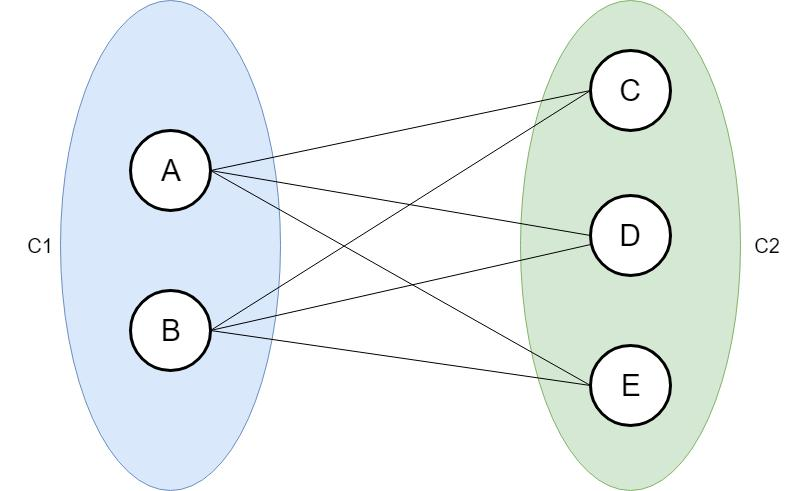

###Questão 1
1. O grafo completo bipartido K m,n é hamiltoniano? Explique.

>Um grafo G é hamiltoniano se tem um ciclo hamiltoniano. Um ciclo hamiltoniano em um grafo G é um caminho(ou circuito) que contém todos vértice em G.
	Um grafo bipartido K m,n não é necessariamente um grafo hamiltoniano. No caso em que o grafo bipartido tem m 6 = n , cada conjunto só pode ter ligação com o outro. Então, não podemos retornar ao vértice inicial sem repetir um dos vértices do meio do caminho. Mostramos isto com um contra-exemplo.
	Na figura 1 temos um grafo bipartido K com n = 2 e m = 3. Começamos nosso caminho a partir do conjunto C1 pelo caminho (A,C,B,E) ou (A,C,B,D) e vemos que não tem como ir ao vértice que sobra em C2, isso porque não há mais vértices em C1 que já não estejam no caminho.
	Se começamos em C2 temos um caminho (C,A,D,B,E) que é um caminho hamiltoniano, porém, não temos como fechar o ciclo pois o vértice que sobra pertence ao mesmo conjunto do ultimo vértice do caminho, e não podemos ligar eles com uma aresta, pois não teríamos mais um grafo bipartido.
	Portanto, concluímos que um grafo bipartido K m,n completo não é necessariamente hamiltoniano.

>

>Figura 1: Grafo bipartido K m,n completo utilizado como contra exemplo na questão 1.

###Questão 2
2.Desenhe um grafo que seja de Euler, mas não hamiltoniano. Explique.

###Questão 3
3.Prove ou mostre um contra-exemplo: Todo grafo com número de vértices n ≥ 3 e grau mínimo δ(G) ≥ 2 possui um ciclo hamiltoniano.

###Questão 4
4.Prove que um grafo conexo G é um grafo euleriano se e somente se seu conjunto de arestas puder ser decomposto em ciclos.

###Questão 5
5.Mostre que o ciclo ebacde é uma solução para o problema do caixeiro-viajante, para o grafo mostrado a seguir.	